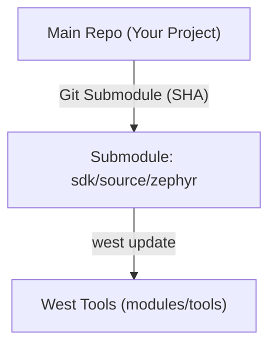

# Zephyr SDK 仓库同步与 Submodule 管理

> [!note]
> **Ref:** [Git Submodule Documentation](https://git-scm.com/book/en/v2/Git-Tools-Submodules) | [West Manifests](https://docs.zephyrproject.org/latest/develop/west/manifest.html)

在 Zephyr 开发环境中，`sdk/source/zephyr` 是核心的内核代码库。将其作为主仓库的 `submodule` 是一种平衡“版本控制”与“便捷同步”的最佳实践。

## 1. 操作记录 (Operation Log)

将现有的本地 `zephyr` 仓库添加为子模块：

```bash
# 修正 .gitignore 以允许追踪 sdk/source/
# 添加子模块
git submodule add https://github.com/zephyrproject-rtos/zephyr sdk/source/zephyr
```

## 2. 为什么将 Zephyr 设为 Submodule？

### 2.1 版本锁定 (Version Locking)
*   **精确追踪**: Submodule 将 Zephyr 锁定在特定的 **commit SHA**。克隆主项目后，通过 `git submodule update` 即可恢复到完全一致的开发环境。
*   **防止破坏**: 避免因 Zephyr 上游（Main 分支）的非预期更新导致应用程序构建失败。

### 2.2 结构清晰 (Project Isolation)
*   **界限明确**: 逻辑上区分了“应用程序代码”与“RTOS 内核代码”。
*   **主库精简**: 主仓库只需记录子模块的指向，无需存储数以万计的内核源文件。

### 2.3 便于定制与上游同步
*   **分支切换**: 可以在子模块目录内轻松切换版本（如从 `v3.5.0` 升级到 `v3.6.0`）进行兼容性测试。
*   **补丁管理**: 如果需要对内核进行少量修改，可以在子模块中直接提交或指向自己的 Fork 仓库，方便管理定制化修改。

## 3. 与 West 工具的关系

Zephyr 使用 `west` 管理多仓库。将 `zephyr` 设为 submodule 后的工作流：

1.  **Git** 负责锁定 `zephyr` 这个核心库的版本。
2.  **West** 负责基于 `zephyr/west.yml` 下载和同步其他的 `modules` (HAL, Crypto, etc.) 和 `tools`。



## 4. 常用维护命令

*   **克隆带子模块的项目**: `git clone --recursive <url>`
*   **更新子模块指针**: 
    ```bash
    cd sdk/source/zephyr
    git checkout <new-version-tag>
    cd ../../../
    git add sdk/source/zephyr
    git commit -m "chore(sdk): update zephyr to <version>"
    ```
