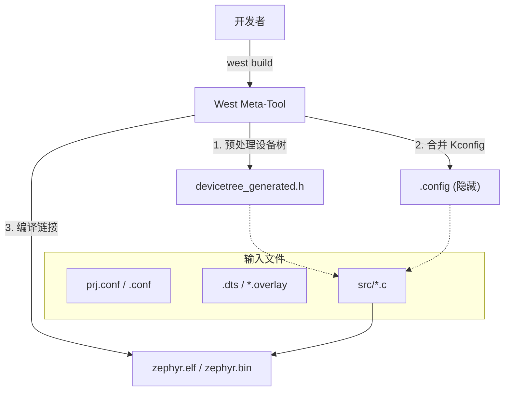

# Zephyr 应用工程结构与配置综述

基于 Zephyr 官方文档及实践经验，一个标准的 Zephyr 应用程序通常采用以下目录结构和配置模式。

## 1. 标准目录树结构

```text
<app_root>/
├── CMakeLists.txt      # 1. 构建系统入口，定义项目名并链接 Zephyr 宏
├── prj.conf            # 2. 应用级 Kconfig 配置 (软件功能开关)
├── app.overlay         # 3. 通用设备树覆盖 (硬件定义修改)
├── VERSION             # 4. 应用版本定义文件
├── sample.yaml         # 5. 用于 Twister 测试框架的元数据
├── src/                # 6. 源代码目录
│   └── main.c          # 应用程序主逻辑
└── boards/             # 7. 特定板卡的适配目录
    ├── <BOARD>.conf    # 板级 Kconfig 覆盖 (仅对该板卡生效)
    └── <BOARD>.overlay # 板级设备树覆盖 (仅对该板卡生效)
```

## 2. 核心配置文件详解

### 2.1 构建入口：`CMakeLists.txt`
这是 CMake 构建系统的脚本。它负责：
- 声明最低 CMake 版本要求。
- 搜索并加载 Zephyr 基础包 (`find_package(Zephyr)`)。
- 定义应用的目标源文件 (`target_sources(app PRIVATE ...)`)。

### 2.2 软件配置：`prj.conf`
采用 Kconfig 语法，用于开启或关闭内核功能及驱动。
- **作用域**：全局生效（除非被 `boards/<BOARD>.conf` 覆盖）。
- **示例**：`CONFIG_GPIO=y` 启用 GPIO 驱动支持；`CONFIG_LOG=y` 启用日志系统。

### 2.3 硬件描述：`*.overlay`
用于在不修改 Zephyr 官方板卡定义的情况下，动态修改硬件配置。
- **`app.overlay`**：对该应用支持的所有板卡生效。
- **`boards/<BOARD>.overlay`**：仅当编译目标为特定板卡时加载。
- **典型用途**：定义 LED 引脚、配置 I2C 传感器地址、修改串口波特率等。

### 2.4 版本控制：`VERSION`
一个简单的文本文件，定义应用版本。
- **字段**：`VERSION_MAJOR`, `VERSION_MINOR`, `PATCHLEVEL`。
- **优势**：构建系统会自动生成版本宏，开发者可以在 C 代码中通过 `APP_VERSION_STR` 直接引用。

## 3. 应用类型划分

| 类型 | 位置描述 | 适用场景 |
| :--- | :--- | :--- |
| **Repository** | 位于 `zephyr/samples` 内部 | 提交给官方的示例代码 |
| **Workspace** | 位于 `west` 工作区内，但不在 `zephyr/` 仓内 | **推荐方式**，适合公司/个人正式项目 |
| **Freestanding** | 位于 `west` 工作区外部 | 临时快速测试，不依赖特定 workspace 结构 |

---

## 4. 构建流向示意


