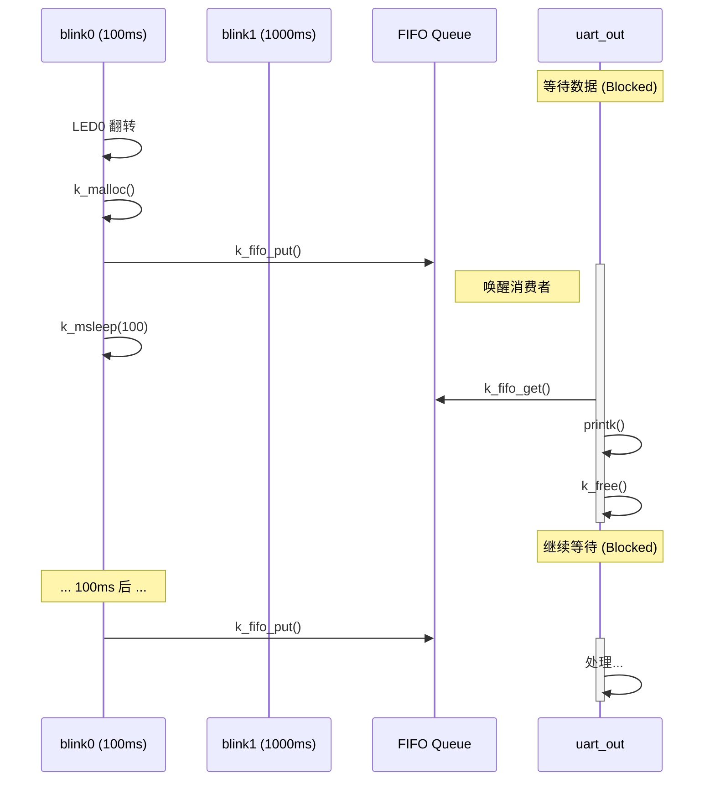

# 02-Threads 工程源码分析

本工程演示了 Zephyr 中典型的 **多线程协作** 与 **生产者-消费者 (Producer-Consumer)** 模型。

## 1. 配置文件 (`prj.conf`) 解析

```properties
CONFIG_PRINTK=y              # 启用 printk 打印功能
CONFIG_HEAP_MEM_POOL_SIZE=256 # 定义系统堆大小为 256 字节
CONFIG_ASSERT=y              # 启用断言检查
CONFIG_GPIO=y                # 启用 GPIO 驱动
```

*   **关键点**：`CONFIG_HEAP_MEM_POOL_SIZE` 是必须的，因为源码中使用了 `k_malloc` 来动态分配消息内存。如果去掉这一行，`k_malloc` 将返回 NULL，导致程序通过 `__ASSERT` 崩溃。

## 2. 核心代码 (`src/main.c`) 逻辑

### 2.1 数据结构与 IPC 定义

```c
// 定义传输的数据包结构
struct printk_data_t {
    void *fifo_reserved; /* 必须保留！作为 FIFO 链表的指针域 */
    uint32_t led;
    uint32_t cnt;
};

// 静态定义一个 FIFO 队列
K_FIFO_DEFINE(printk_fifo);
```
*   **Zephyr FIFO 机制**：Zephyr 的 FIFO 是“零拷贝”的链表操作。放入 FIFO 的数据结构**必须**在头部保留一个 `void *` 指针的空间供内核使用。

### 2.2 线程定义 (静态创建)

使用 `K_THREAD_DEFINE` 宏在编译时静态分配了三个线程：

```c
#define STACKSIZE 1024
#define PRIORITY 7

K_THREAD_DEFINE(blink0_id, STACKSIZE, blink0, NULL, NULL, NULL, PRIORITY, 0, 0);
K_THREAD_DEFINE(blink1_id, STACKSIZE, blink1, NULL, NULL, NULL, PRIORITY, 0, 0);
K_THREAD_DEFINE(uart_out_id, STACKSIZE, uart_out, NULL, NULL, NULL, PRIORITY, 0, 0);
```
*   **优先级**：三个线程优先级均为 `7`（抢占式）。
*   **执行流**：由于优先级相同，且使用了 `k_msleep` 和 `k_fifo_get` (阻塞)，它们会交替运行，不会出现因为优先级相同而导致的死循环（除非未开启时间片轮转且未主动放弃 CPU，但这里有阻塞操作，所以是安全的）。

### 2.3 生产者线程 (`blink0` / `blink1`)

这两个线程逻辑复用了 `blink()` 函数：
1.  **控制硬件**：翻转 LED 电平。
2.  **分配内存**：`char *mem_ptr = k_malloc(size);` 从堆中申请小块内存。
3.  **发送数据**：填充数据后，使用 `k_fifo_put(&printk_fifo, mem_ptr);` 将指针挂入队列。
4.  **休眠**：`k_msleep(sleep_ms);` 主动放弃 CPU，让出给其他线程。

### 2.4 消费者线程 (`uart_out`)

```c
void uart_out(void)
{
    while (1) {
        // 1. 阻塞等待：队列为空时挂起，有数据时被唤醒
        struct printk_data_t *rx_data = k_fifo_get(&printk_fifo, K_FOREVER);
        
        // 2. 处理数据
        printk("Toggled led%d; counter=%d
", rx_data->led, rx_data->cnt);
        
        // 3. 释放内存：必须由消费者释放，否则会导致内存泄漏
        k_free(rx_data);
    }
}
```

## 3. 系统运行图解



## 4. 学习总结

1.  **IPC 传递的是所有权**：生产者 `malloc`，消费者 `free`。这是嵌入式系统中常见的内存管理模式。
2.  **FIFO 结构体要求**：自定义结构体放入 FIFO 必须预留首字段。
3.  **同步机制**：`k_fifo_get` 自带阻塞功能，充当了信号量的角色，实现了线程同步。
