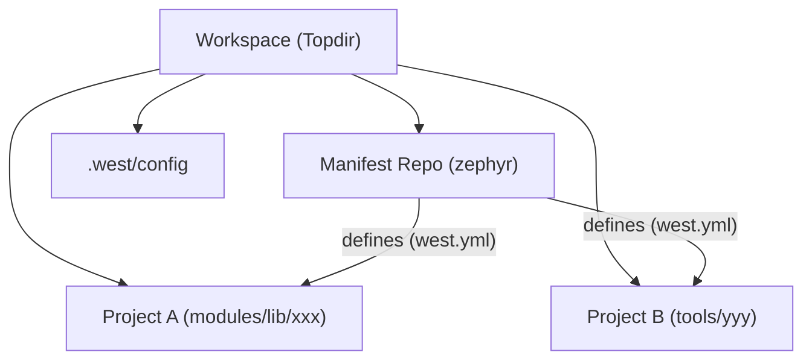

# West 元工具详解

West 是 Zephyr 项目的元工具（Meta-tool），类似于 Android 的 `repo` 或 Git 的 `submodule`，但针对 Zephyr 的开发流程进行了深度定制。它不仅管理多仓库代码，还作为构建、烧录和调试的前端接口。

## 1. 核心概念

在使用 West 之前，需要理解以下核心概念：

- **Workspace (工作区)**: 包含所有项目代码的根目录。
- **Manifest Repository (清单仓库)**: 包含 `west.yml` 文件的 Git 仓库，通常是 `zephyr` 主仓库或用户自己的应用仓库。
- **Manifest File (清单文件)**: YAML 格式的文件（默认 `west.yml`），定义了工作区内所有项目的 URL、版本和路径。
- **Projects (项目)**: 由清单文件管理的 Git 仓库。
- **Extensions (扩展)**: 某些项目（如 zephyr）可以提供额外的 West 命令（如 `build`, `flash`）。



## 2. 工作区管理命令

### 2.1 初始化 (init)
初始化一个新的 West 工作区。

```bash
# 从远程 URL 克隆清单仓库并初始化
west init -m https://github.com/zephyrproject-rtos/zephyr --mr v3.5.0 my-workspace

# 在当前目录初始化（假设当前目录已是 git 仓库且包含 west.yml）
west init -l .
```

*   `-m, --manifest-url`: 清单仓库 URL。
*   `--mr, --manifest-rev`: 清单仓库的分支、Tag 或 SHA（默认 `main`）。
*   `-l, --local`: 在本地已有仓库基础上初始化。

### 2.2 更新 (update)
根据清单文件解析并更新所有项目。

```bash
# 更新所有项目
west update

# 仅更新特定项目
west update zephyr
```

*   这是最常用的命令之一，用于同步远程代码。
*   会自动处理 git fetch, checkout, rebase 等操作。

### 2.3 其他管理命令
*   `west list`: 列出当前工作区的所有项目及其路径、版本。
*   `west status`: 对所有项目执行 `git status`。
*   `west diff`: 对所有项目执行 `git diff`。
*   `west forall -c "git command"`: 对所有项目执行指定的 Shell 命令。

## 3. 构建与开发命令 (Extensions)

这些命令实际上是 Zephyr 仓库提供的扩展，只有在安装了 Zephyr 源码后才可用。

### 3.1 编译 (build)
前端封装了 CMake 和 Ninja。

```bash
# 编译当前目录的应用，目标板为 nrf52840dk_nrf52840
west build -b nrf52840dk_nrf52840 .

# 重新编译（不清除构建目录）
west build

# 强制完全重新编译 (Pristine build)
west build -p

# 仅运行 CMake 配置步骤
west build -c

# 指定构建目录（默认为 build/）
west build -d build-my-board
```

*   `-b, --board`: 指定目标开发板。
*   `-p, --pristine`: `auto` (默认), `always` (强制清除), `never`。
*   `-t, --target`: 运行特定的构建目标 (如 `menuconfig`, `run`, `ram_report`)。
    *   `west build -t menuconfig`: 打开 Kconfig 配置界面。

### 3.2 烧录 (flash)
调用底层的烧录工具（如 JLink, OpenOCD, PyOCD）。

```bash
# 烧录当前构建目录下的固件
west flash

# 指定烧录器
west flash --runner jlink

# 擦除整片 Flash 后烧录
west flash --erase
```

### 3.3 调试 (debug / debugserver)
启动 GDB 调试会话。

```bash
# 启动 GDB 并连接
west debug

# 仅启动 GDB Server (供 IDE 连接)
west debugserver
```

## 4. 清单文件 (west.yml) 规范

`west.yml` 是工作区的核心配置文件。

```yaml
manifest:
  # 远程仓库的基础 URL 别名
  remotes:
    - name: zephyrproject-rtos
      url-base: https://github.com/zephyrproject-rtos
    - name: my-private-server
      url-base: ssh://git@my-server.com

  # 默认设置
  defaults:
    remote: zephyrproject-rtos
    revision: main

  # 项目列表
  projects:
    # 核心 Zephyr 仓库 (如果自身不是 manifest repo)
    - name: zephyr
      repo-path: zephyr
      revision: v3.5.0
      import: true  # 导入 zephyr/west.yml 中定义的项目

    # 外部模块
    - name: my-module
      remote: my-private-server
      path: modules/lib/my-module
      revision: develop

  # 自身配置
  self:
    path: application  # 自身仓库在工作区中的路径
```

## 5. 配置 (config)

类似于 `git config`，用于管理本地、全局或系统级的配置。

```bash
# 查看所有配置
west config -l

# 设置默认开发板 (避免每次 build 都加 -b)
west config build.board nrf52840dk_nrf52840

# 设置默认构建目录格式
west config build.dir-fmt "build/{board}/{app}"
```

## 6. 其他实用功能

*   **Blobs**: 管理二进制大对象（如闭源库）。`west blobs list`, `west blobs fetch`。
*   **SDK**: 管理 Zephyr SDK。`west sdk list`, `west sdk install`。
*   **SPDX**: 生成 SBOM (Software Bill of Materials)。`west spdx`。
