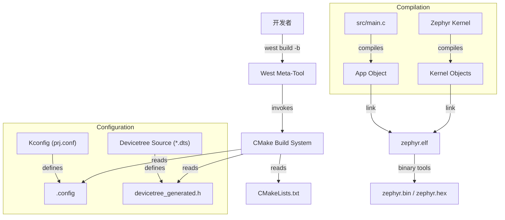

# Blinky 工程结构与构建机制分析

本文档详细分析了 `@prj/01-blinky` 示例工程的结构、配置文件及其在 Zephyr 生态中的构建流程。

## 1. 工程目录结构

```text
prj/01-blinky/
├── CMakeLists.txt      # 构建系统入口
├── prj.conf            # 应用级 Kconfig 配置
├── sample.yaml         # Twister 测试框架元数据
├── src/
│   └── main.c          # 应用程序源码
├── boards/             # (可选) 存放特定板卡的设备树覆盖或配置文件
└── README.rst          # 工程说明文档
```

## 2. 核心构建文件

### 2.1 CMakeLists.txt
这是 CMake 构建系统的脚本，负责定义项目并链接 Zephyr 内核。

```cmake
cmake_minimum_required(VERSION 3.20.0)
find_package(Zephyr REQUIRED HINTS $ENV{ZEPHYR_BASE})
project(blinky)

target_sources(app PRIVATE src/main.c)
```
- `find_package(Zephyr)`: 加载 Zephyr 的构建宏和内核逻辑。
- `target_sources(app ...)`: 将源码添加到名为 `app` 的特定库中。

### 2.2 prj.conf
用于静态配置内核功能和驱动。

```text
CONFIG_GPIO=y
```
- 该选项启用了 GPIO 子系统。在 Blinky 工程中，由于需要控制 LED 引脚，必须开启此项。

### 2.3 sample.yaml
供 Zephyr 的测试工具 `twister` 使用。

```yaml
sample:
  name: Blinky Sample
tests:
  sample.basic.blinky:
    tags: [LED, gpio]
    filter: dt_enabled_alias_with_parent_compat("led0", "gpio-leds")
    depends_on: gpio
```
- `filter`: 确保只有在设备树中定义了 `led0` 别名且其父节点兼容 `gpio-leds` 的板卡才会运行此测试。

## 3. 构建流程示意



## 4. 关键点总结
- **Kconfig** 决定了“哪些代码被编译”（如 `CONFIG_GPIO=y`）。
- **Devicetree (DTS)** 决定了“代码如何与硬件绑定”（如 `led0` 指向哪个引脚）。
- **West** 是统一的入口，协调配置、编译、烧录和调试。
