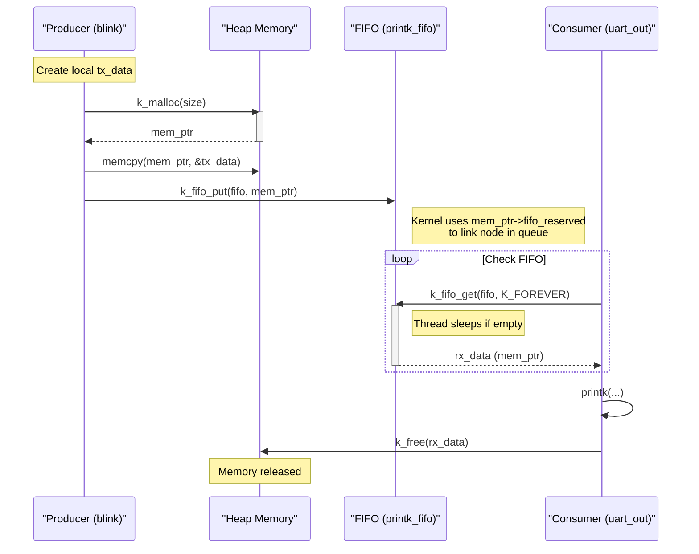

# FIFO Communication Mechanism Deep Dive

本文深入分析 `prj/02-threads` 示例工程中的 FIFO 通信机制，探讨 `printk_fifo` 如何在生产者（blink线程）和消费者（uart_out线程）之间传递消息，并结合 Zephyr 内核源码解析其底层实现原理。

## 1. 示例工程概述

`prj/02-threads` 演示了多线程环境下的数据传递。
- **生产者**: 两个 `blink` 线程（`blink0` 和 `blink1`），它们不仅控制 LED 闪烁，还将闪烁计数发送到 FIFO。
- **消费者**: 一个 `uart_out` 线程，从 FIFO 中读取数据并通过 `printk` 打印到控制台。
- **通信媒介**: `k_fifo` (First In, First Out 队列)。

## 2. 数据结构与 FIFO 定义

### 2.1 FIFO 定义

在 `src/main.c` 中，使用 `K_FIFO_DEFINE` 宏静态定义了一个名为 `printk_fifo` 的 FIFO 对象：

```c
K_FIFO_DEFINE(printk_fifo);
```

### 2.2 消息结构体 `struct printk_data_t`

这是 FIFO 中传输的数据单元：

```c
struct printk_data_t {
	void *fifo_reserved; /* 1st word reserved for use by fifo */
	uint32_t led;
	uint32_t cnt;
};
```

**关键点**: `void *fifo_reserved` 必须是结构体的第一个成员。
- **原因**: Zephyr 的 FIFO 底层实现（基于 `k_queue`）使用单向链表来管理数据项。
- **机制**: 当数据项被放入 FIFO 时，内核会将这个保留字段用作链表的 `next` 指针，指向队列中的下一个元素。如果缺少这个字段，或者它不在起始位置，FIFO 操作将破坏数据内容或导致系统崩溃。

## 3. 通信流程解析

### 3.1 生产者 (Producer)

`blink` 函数作为生产者，执行以下步骤：

1.  **数据准备**: 创建局部变量 `tx_data` 并赋值。
2.  **内存分配**: 使用 `k_malloc` 动态分配内存。这是因为 `k_fifo_put` 传递的是指针，如果传递局部变量的地址，线程栈上的数据在函数返回或循环迭代后会失效。
3.  **数据复制**: 将数据从栈复制到堆内存。
4.  **入队**: 调用 `k_fifo_put` 将数据指针放入 FIFO。

```c
// src/main.c
struct printk_data_t tx_data = { .led = id, .cnt = cnt };

size_t size = sizeof(struct printk_data_t);
char *mem_ptr = k_malloc(size); // 动态分配
__ASSERT_NO_MSG(mem_ptr != 0);

memcpy(mem_ptr, &tx_data, size); // 复制数据

k_fifo_put(&printk_fifo, mem_ptr); // 入队
```

### 3.2 消费者 (Consumer)

`uart_out` 函数作为消费者，执行以下步骤：

1.  **出队**: 调用 `k_fifo_get` 阻塞等待数据。`K_FOREVER` 表示如果队列为空，线程将一直休眠，直到有数据到来。
2.  **处理数据**: 获取到数据指针后，访问数据成员并打印。
3.  **内存释放**: 使用 `k_free` 释放生产者分配的内存，防止内存泄漏。

```c
// src/main.c
while (1) {
    struct printk_data_t *rx_data = k_fifo_get(&printk_fifo, K_FOREVER); // 阻塞获取
    printk("Toggled led%d; counter=%d
", rx_data->led, rx_data->cnt);
    k_free(rx_data); // 释放内存
}
```

## 4. 内核实现原理 (Kernel Internals)

通过查阅 Zephyr 内核源码 (`kernel/queue.c` 和 `include/zephyr/kernel.h`)，我们可以看到 `k_fifo` 实际上是 `k_queue` 的一层封装。

### 4.1 `k_fifo_put` 实现

`k_fifo_put` 是一个宏，最终调用 `k_queue_append`：

```c
// include/zephyr/kernel.h
#define k_fifo_put(fifo, data) 
	({ 
	void *_data = data; 
	... 
	k_queue_append(&(fifo)->_queue, _data); 
	... 
	})
```

`k_queue_append` 进而调用 `queue_insert`。在 `queue_insert` 中，内核利用数据项的第一个字（即 `fifo_reserved`）来构建链表节点：

```c
// kernel/queue.c
static int32_t queue_insert(..., void *data, bool alloc, ...)
{
    // ...
    if (alloc) {
        // ... (k_fifo_alloc_put case)
    } else {
        sys_sfnode_init(data, 0x0); // 将 data 初始化为链表节点
    }
    // ...
    sys_sflist_insert(&queue->data_q, prev, data); // 插入链表
    // ...
}
```

这里 `sys_sfnode_init(data, 0x0)` 实际上就是操作了 `data` 指向的内存区域的起始位置（即 `fifo_reserved`），将其设置为链表节点结构。

### 4.2 `k_fifo_get` 实现

`k_fifo_get` 最终调用 `k_queue_get`。

```c
// kernel/queue.c
void *z_impl_k_queue_get(struct k_queue *queue, k_timeout_t timeout)
{
    // ...
    if (likely(!sys_sflist_is_empty(&queue->data_q))) {
        sys_sfnode_t *node;
        node = sys_sflist_get_not_empty(&queue->data_q); // 从链表移除节点
        data = z_queue_node_peek(node, true); // 获取数据指针
        return data;
    }
    // ... 等待逻辑
}
```

## 5. 数据流图 (Mermaid)



## 6. 总结

Zephyr 的 FIFO 机制是一种高效的 IPC 手段。
1.  **零拷贝 (Zero-copy in Kernel)**: 内核在入队和出队时只传递指针，不复制数据内容，效率极高。
2.  **侵入式链表 (Intrusive List)**: 要求数据结构第一个字保留给内核使用，这是为了实现零拷贝和避免额外的内核内存分配。
3.  **内存管理责任**: 开发者必须负责数据的生命周期管理（如本例中的 `k_malloc` 和 `k_free`），确保指针在传递过程中指向有效的内存区域。
