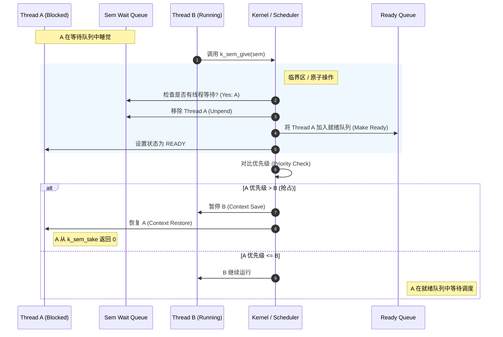

# 深入解析：k_sem_take 与 Wait Queue 机制

当一个线程因为调用 `k_sem_take`（且信号量计数为 0）而进入 **Pending (阻塞/挂起)** 状态后，它实际上是从 **就绪队列 (Ready Queue)** 移动到了该信号量特有的 **等待队列 (Wait Queue)** 中。

要让它“复活”并回到 **Ready Queue**，必须经历 **触发 (Trigger)** 和 **调度迁移 (Migration)** 两个关键步骤。

## 1. 触发源：谁来打破沉默？
这个过程通常由 **另一个线程**（或中断服务程序 ISR）发起。
假设 **Thread A** 正在阻塞等待信号量 `sem`。
**Thread B** 调用了 `k_sem_give(&sem)`。

这就是一切的开始。

## 2. 内核内部流程 (Under the Hood)

当 `k_sem_give(&sem)` 被调用时，内核会执行以下原子操作序列：

### 第一步：检查等待队列 (Check Wait Queue)
内核查看 `sem->wait_q`。
*   **如果不为空**：说明有线程（如 Thread A）在等这个信号量。内核决定 **不增加** 信号量的 `count`，而是直接把这个“使用权”移交给等待中的 Thread A。

### 第二步：解挂 (Unpend)
内核调用内部函数（类似于 `z_unpend_thread`）：
1.  **出队**：将 Thread A 从 `sem->wait_q` 中移除。
2.  **状态变更**：清除 Thread A 的 `_THREAD_PENDING` 标志位。此时 Thread A 既不在 Wait Q 也不在 Ready Q，处于游离状态。

### 第三步：就绪 (Make Ready)
内核调用内部函数（类似于 `z_ready_thread`）：
1.  **入队**：根据 Thread A 的优先级，将其插入到系统的 **Ready Queue** 中正确的位置。
2.  **状态变更**：设置 Thread A 的 `_THREAD_READY` 标志位。
3.  **返回值的准备**：内核会设置 Thread A 在 `k_sem_take` 中的返回值为 0（表示成功拿到信号量）。

### 第四步：重新调度决策 (Reschedule Decision)
这是最关键的一步。Thread A 回到了 Ready Q，但它能立刻运行吗？
内核比较 **Thread A** 和 **当前运行的 Thread B** 的优先级：

*   **情况 1：Thread A 优先级更高 (Preemption)**
    *   内核触发上下文切换 (`z_swap`)。
    *   Thread B 被放回 Ready Q（头部）。
    *   CPU 寄存器被保存，Thread A 的上下文被恢复。
    *   **Thread A 从 `k_sem_take` 函数内部“醒来”，返回 0，继续执行。**

*   **情况 2：Thread B 优先级更高或相等**
    *   内核 **不** 进行切换。
    *   Thread A 老老实实呆在 Ready Q 里排队。
    *   Thread B 继续跑，直到它自己阻塞或时间片用完。

## 3. 图解流程 (Mermaid)

## 总结
从 Pending Q 返回 Ready Q 的本质是：
1.  **资源满足**：有人 (`k_sem_give`) 提供了资源。
2.  **队列搬家**：内核把线程结构体从 `sem->wait_q` **剪切** 下来，**粘贴** 到 `_kernel.ready_q`。
3.  **抢占检查**：检查这次搬家是否需要立即触发 CPU 换人。
