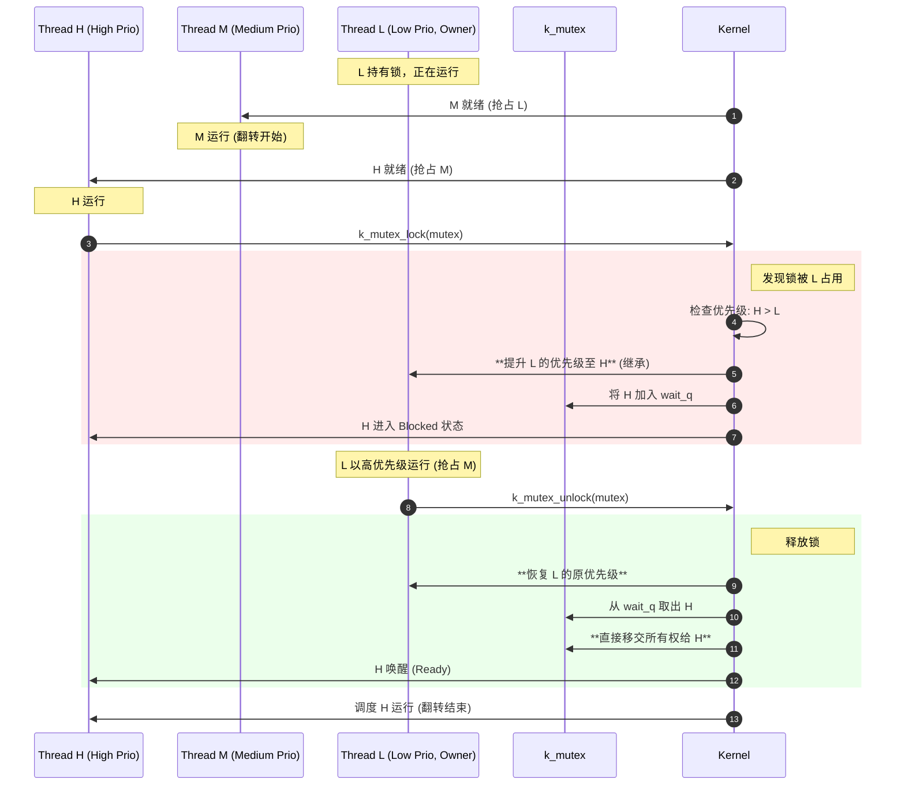

# 深入解析：k_mutex 与优先级继承 (Priority Inheritance)

Zephyr 的互斥量 (`k_mutex`) 与信号量 (`k_sem`) 在底层的 Wait Q 机制上非常相似，但引入了两个关键特性：**所有权 (Ownership)** 和 **优先级继承 (Priority Inheritance)**。

## 1. 核心区别：Mutex vs Semaphore

虽然它们都使用 `wait_q` 来挂起线程，但 Mutex 有明确的 **所有权 (Ownership)** 概念：

*   **Semaphore**：谁都可以 Give，谁都可以 Take。没有“主人”概念。
*   **Mutex**：
    *   **谁锁谁解**：只有锁住它的线程（Owner）才能解锁它。
    *   **递归锁定**：同一个线程可以多次锁同一个 Mutex（计数增加），只要解锁次数匹配即可。
    *   **优先级翻转保护**：当高优先级线程等待低优先级线程持有的 Mutex 时，内核会临时提升低优先级线程的优先级。

## 2. 优先级翻转 (Priority Inversion) 详解

优先级翻转是实时系统中一个经典且危险的问题。

### 场景示例：低-中-高 三线程模型

假设我们有三个线程，优先级如下：
*   **High (H)**: 高优先级任务。
*   **Medium (M)**: 中优先级任务。
*   **Low (L)**: 低优先级任务。

**翻转过程：**

1.  **L 运行**：L 获取了一个互斥锁 `lock`。
2.  **M 抢占**：M 变得就绪（且不依赖 `lock`），抢占了 L，开始长时间运行。
3.  **H 就绪**：H 变得就绪，抢占了 M。
4.  **H 阻塞**：H 尝试获取 `lock`，但发现被 L 持有，**且L 永远没有机会归还mutex**。H 被迫进入 `lock->wait_q` 阻塞。
5.  **死结**：
    *   H 等待 L 释放锁。
    *   L 需要 CPU 时间来运行并释放锁。
    *   但是 M 的优先级高于 L，只要 M 不让出 CPU，L 就永远无法运行。
    *   **结果**：中优先级的 M 事实上阻塞了高优先级的 H。这就是优先级翻转。

### Zephyr 的解决方案：优先级继承 (Priority Inheritance)

Zephyr 通过 **优先级继承协议 (Priority Inheritance Protocol, PIP)** 来解决此问题。

**解决过程：**

1.  当 **H** 尝试获取被 **L** 持有的锁时，内核检测到 `H.prio > L.prio`。
2.  **提升 (Boost)**：内核立即将 **L** 的优先级提升到与 **H** 相同（甚至略高，取决于具体实现细节，但在 Zephyr 中通常是等于 H）。
3.  **抢占 M**：现在 L 的优先级变成了 H，这比 M 高。调度器会立即挂起 M，让 L 继续运行。
4.  **加速释放**：L 以高优先级运行，直到它调用 `k_mutex_unlock`。
5.  **恢复 (De-boost)**：L 释放锁后，内核将其优先级恢复回原本的低优先级。
6.  **H 获得锁**：H 被唤醒，获得锁并继续运行。

## 3. `k_mutex` 数据结构与实现深度剖析

### 数据结构
在 `include/zephyr/kernel.h` 中，`k_mutex` 的定义包含：

```c
struct k_mutex {
    _wait_q_t wait_q;            /* 等待该互斥量的线程队列 */
    struct k_thread *owner;      /* 当前持有锁的线程 (Owner) */
    uint32_t lock_count;         /* 递归锁定计数 */
    int owner_orig_prio;         /* Owner 的原始优先级 (用于恢复) */
};
```

### `k_mutex_lock` 的 Wait Q 机制

当线程 A 试图锁住一个已经被线程 B 持有的 Mutex 时：

1.  **所有权检查**：
    *   如果 `owner == NULL`：A 成功获得锁，`mutex->owner = A`，`lock_count = 1`。
    *   如果 `owner == A` (递归锁)：`lock_count++`，返回成功。
    *   如果 `owner == B` (冲突)：进入等待流程。

2.  **优先级继承逻辑**：
    在将 A 放入 Wait Q 之前，内核检查优先级：
    *   **如果 A 的优先级 > B 的优先级**：
        *   内核意识到发生了潜在的优先级翻转。
        *   **记录**：将 B 的当前优先级保存到 `owner_orig_prio`（如果还没保存过）。
        *   **提升**：调用 `k_thread_priority_set(B, A->prio)`。
        *   这迫使 B 尽快运行完临界区。

3.  **入队 (Pend)**：
    *   A 状态变为 `_THREAD_PENDING`。
    *   A 从 Ready Q 移出。
    *   A 加入 `mutex->wait_q`。

### `k_mutex_unlock` 的唤醒流程

当线程 B 调用 `k_mutex_unlock(&mutex)` 时：

1.  **递归检查**：
    *   `lock_count--`。
    *   如果 `lock_count > 0`，说明锁未完全释放，直接返回。

2.  **优先级恢复 (Priority De-boost)**：
    *   内核检查 B 的优先级是否被提升过 (`B->prio != B->static_prio`)。
    *   如果是，且 B 不再持有其他导致提升的 Mutex（Zephyr 支持嵌套继承），内核将 B 的优先级 **恢复** 到 `owner_orig_prio` 或其静态优先级。

3.  **所有权移交与唤醒**：
    *   检查 `mutex->wait_q`。
    *   **有线程等待 (如 A)**：
        *   `mutex->owner` 直接变为 A（原子移交）。
        *   A 从 `wait_q` 移出，加入 `Ready Q`。
    *   **无线程等待**：
        *   `mutex->owner` 设为 NULL。

## 4. 流程图解 (Mermaid)


