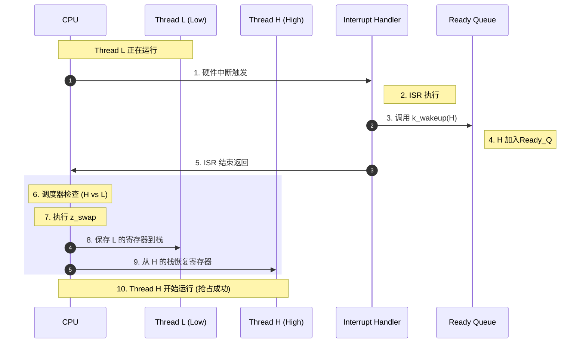

# 深入解析：抢占调度机制 (Preemptive Scheduling)

抢占 (Preemption) 是实时操作系统 (RTOS) 的核心能力。它确保了高优先级任务在就绪时能立即获得 CPU，无论当前正在运行什么线程（只要当前线程不是不可抢占的）。

## 1. 抢占的核心触发点：何时检查？

抢占并不是随机发生的，它必须在 **重新调度点 (Reschedule Points)** 被触发。最常见的抢占场景是：**一个非运行态的线程转变为就绪态 (Ready)**。

### 触发场景 A：外部中断 (ISR) 唤醒
1.  **Thread L** 正在运行。
2.  发生硬件中断（如定时器、传感器数据到达）。
3.  **ISR** 执行，并调用了如 `k_sem_give` 或 `k_wakeup` 等 API，使得 **Thread H** 变为 Ready。
4.  **ISR 退出**。这是最典型的抢占点。

### 触发场景 B：当前线程行为
1.  **Thread L** 调用了某个 API（如 `k_thread_start(H)`）显式启动了 **Thread H**。

## 2. 抢占的底层逻辑链

当 Thread H 变为 Ready 时，内核会经历以下三个关键逻辑步骤：

### 步骤 1：入队与排序 (Enqueue)
内核将 Thread H 插入 **Ready Queue**。
*   由于 Zephyr 的 Ready Queue 是按优先级排序的（或者在多级队列中按优先级选取），H 会被放在队列中比 L 更靠前的位置。

### 2. 调度决策 (Scheduling Decision)
内核调用 `z_get_next_ready_thread()`。
*   调度器检查 Ready Queue 的头部。
*   发现 `Head->Priority (H) < Current->Priority (L)` (数字越小优先级越高)。
*   **判断结果**：必须切换。

### 3. 上下文切换 (Context Switch)
这是抢占的物理执行过程，通常涉及汇编级的 `z_swap` 操作。

1.  **保存旧上下文**：将 **Thread L** 的 CPU 寄存器（PC, SP, 通用寄存器等）压入 L 的私有栈中。
2.  **更新状态**：将 L 的状态更新为 Ready（不再是 Running）。
3.  **恢复新上下文**：从 **Thread H** 的栈中弹出之前保存的寄存器值。
4.  **跳转执行**：将 CPU 的程序计数器 (PC) 指向 H 之前停下的位置。

## 3. 协作式 vs 抢占式的阻碍

抢占能否成功，还取决于 **Thread L** 的属性：

*   **如果 L 是抢占式线程 (Priority >= 0)**：
    *   抢占会立即发生（除非 L 锁定了调度器）。
*   **如果 L 是协作式线程 (Priority < 0)**：
    *   **抢占不会立即发生**。尽管 H 的优先级更高，但 L 拥有“不被干扰”的特权。
    *   H 只能老老实实在 Ready Queue 的头部等着。
    *   直到 L 主动调用 `k_yield` 或进入阻塞，H 才能拿到 CPU。

## 4. 图解抢占过程 (ISR 触发)

## 5. 调度器锁定 (`k_sched_lock`)
即使 L 是抢占式线程，它也可以通过 `k_sched_lock()` 临时禁止抢占。
*   **原理**：锁定后，调度器会暂时忽略所有抢占请求。
*   **注意**：中断 (ISR) 仍然可以运行并唤醒高优先级线程，但 ISR 返回后，CPU 会强制回到被锁定的 L 线程，直到它调用 `k_sched_unlock()`。

## 总结
抢占是 **优先级驱动 (Priority-driven)** 与 **重新调度点 (Reschedule Points)** 共同作用的结果。它通过内核底层的上下文切换，实现了微秒级的任务响应速度。
