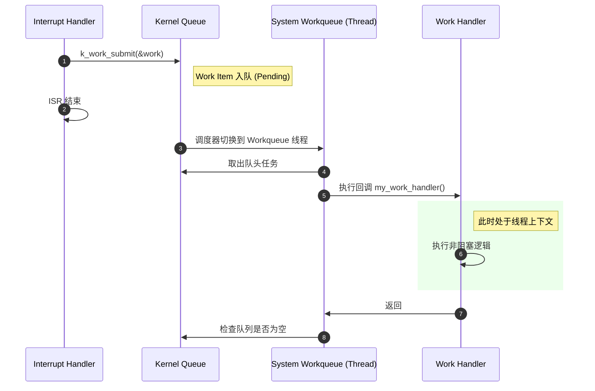

# Workqueue 机制详解

> [!note]
> **Ref:** [Zephyr Workqueue Threads](https://docs.zephyrproject.org/latest/kernel/services/threads/workqueue.html)
>
> **Ref**:[Zephyr API Documentation: Work Queue APIs](https://docs.zephyrproject.org/latest/doxygen/html/group__workqueue__apis.html)

## 1. 核心概念：为什么需要 Workqueue？

在嵌入式开发中，中断服务程序 (ISR) 必须尽可能短小精悍，不能执行耗时操作（如 I2C/SPI 通信、复杂计算），更绝对不能执行**阻塞操作**（如 `k_sleep`, `k_sem_take`）。

**Workqueue (工作队列)** 就是为了解决这个问题而生的。
*   **角色**：它本质上是一个**拥有专用堆栈的内核线程**。
*   **机制**：它维护一个先进先出 (FIFO) 的任务队列。
*   **用途**：ISR 可以将复杂的后续处理任务“提交”给 Workqueue，让 Workqueue 线程在中断退出后的线程上下文中去执行这些任务。
*   **优势**：既保证了 ISR 的快速响应，又允许任务在线程上下文中安全地使用所有内核 API（包括阻塞 API，但要小心，见下文）。

## 2. 系统工作队列 vs 用户工作队列

### System Workqueue (系统工作队列)
*   **定义**：Zephyr 内核默认提供的一个全局共享工作队列。
*   **优先级**：通常配置为 **高优先级协作式线程** (Cooperative, Priority < 0)。
*   **适用场景**：绝大多数驱动程序和协议栈的回调（Callback）都运行在这里。
*   **致命误区**：**千万不要在 System Workqueue 中长时间阻塞！**
    *   如果你在回调函数里 `k_sleep(1000)`，整个系统的其他驱动（如网络、USB、传感器）都会被卡死 1 秒钟，因为它们排在你的任务后面。

### User Workqueue (用户工作队列)
*   **定义**：用户可以创建自己的专用工作队列。
*   **适用场景**：如果你的任务需要长时间运行、或者需要执行阻塞操作，请务必建立自己的 Workqueue，以免影响系统稳定性。
*   **API**: `k_work_queue_start`

## 3. 核心 API 详解

### 3.1 定义工作项 (Work Item)

```c
struct k_work my_work;

void my_work_handler(struct k_work *item) {
    // 这里运行在线程上下文
    printk("Work is executing!
");
}

k_work_init(&my_work, my_work_handler);
```

### 3.2 提交工作 (Submit)

从 ISR 或其他线程中提交任务：

```c
k_work_submit(&my_work); 
// 如果是用户队列：k_work_submit_to_queue(&my_queue, &my_work);
```

### 3.3 延迟工作 (Delayable Work)

有时候我们需要任务在一段时间后执行（例如按键去抖、LED 闪烁）：

```c
struct k_work_delayable my_delayed_work;

void my_delayed_handler(struct k_work *item) {
    // 注意：参数是 k_work，需要转换
    struct k_work_delayable *dwork = k_work_delayable_from_work(item);
    printk("Delayed work executed!
");
}

k_work_init_delayable(&my_delayed_work, my_delayed_handler);

// 100ms 后提交到系统工作队列
k_work_schedule(&my_delayed_work, K_MSEC(100));
```

## 4. 工作项生命周期与状态

一个工作项可能处于以下状态之一或多个：
*   **Queued**: 已提交，在队列中排队。
*   **Running**: 正在被 Workqueue 线程执行。
*   **Pending**: 处于 Queued 或 Running 状态。

> [!TIP]
> **重复提交保护**：如果一个工作项已经是 `Queued` 状态，再次调用 `k_work_submit` **不会**产生新副本，它依然只排队一次。这对于处理高频中断（如网络包到达）非常有用，天然具备了“任务合并”的效果。

## 5. 最佳实践 (Best Practices)

1.  **保持短小**：在 System Workqueue 中的任务应尽快完成。
2.  **避免竞争**：Work Handler 可能与 ISR 或其他线程并发运行，访问共享数据时需加锁。
3.  **不要通过返回值判断**：不要依赖 `k_work_submit` 的返回值来做业务逻辑，任务可能正在被取消或已经运行。
4.  **取消需谨慎**：`k_work_cancel_sync()` 会阻塞当前线程直到任务取消或完成。**绝对不要在 Work Handler 内部调用 cancel_sync 取消自己**，这会导致死锁。

## 6. 流程图解 (Mermaid)


