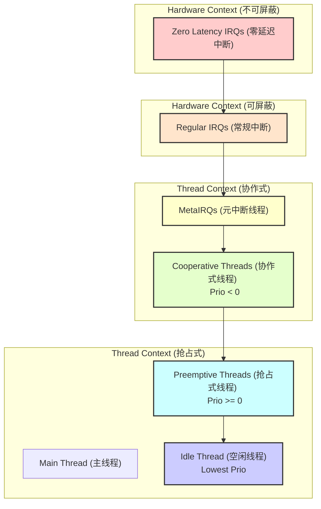

# 中断与线程优先级全景 (Interrupts & Thread Priorities)

> [!note]
> **Ref:** 
> *   `$ZEPHYR_BASE/doc/kernel/services/interrupts.rst`
> *   `$ZEPHYR_BASE/doc/kernel/services/scheduling/index.rst`
> *   `$ZEPHYR_BASE/doc/kernel/services/threads/index.rst`

Zephyr 的实时性核心在于其严谨的 **优先级架构**。不仅线程之间有优先级，中断与线程之间、不同类型的中断之间也存在着严格的抢占关系。

理解这张“全景图”，是编写高可靠、低延迟嵌入式系统的关键。

## 1. 优先级金字塔 (The Priority Pyramid)

在 Zephyr 中，执行上下文的优先级从高到低依次为：

## 2. 硬件上下文 (Hardware Context)

### 2.1 Zero Latency IRQs (零延迟中断)
*   **地位**：**神级优先级**。
*   **特性**：
    *   即使内核锁定了中断 (`irq_lock()`)，它**依然能触发**。
    *   它**不能**调用任何可能导致调度的内核 API（如 `k_sem_give`）。
    *   它只能进行纯硬件操作或修改内存标志。
*   **用途**：极度时间敏感的任务，如电机 FOC 控制环路、高频 ADC 采样。
*   **配置**：`CONFIG_ZERO_LATENCY_IRQS`

### 2.2 Regular IRQs (常规中断)
*   **地位**：标准中断，高于任何线程。
*   **特性**：
    *   可以被 `irq_lock()` 屏蔽。
    *   可以调用非阻塞的内核 API（如 `k_sem_give`, `k_work_submit`）。
    *   ISR 执行完毕后，如果唤醒了高优先级线程，内核会触发**抢占**。
*   **嵌套**：高优先级中断可以抢占低优先级中断（如果架构支持）。

## 3. 线程上下文 (Thread Context)

### 3.1 MetaIRQs (元中断线程)
*   **地位**：**线程中的特权阶级**。
*   **优先级**：位于协作式优先级的顶端（通常是负值中最小的，如 -CONFIG_NUM_COOP_PRIORITIES）。
*   **特性**：
    *   本质上是协作式线程，但主要用于处理那些“必须在 ISR 之后立即执行”的任务。
    *   常用于蓝牙/网络协议栈的底层调度（Bottom Half）。
    *   它会抢占所有其他线程，但会被中断抢占。

### 3.2 Cooperative Threads (协作式线程)
*   **优先级**：负值 (Negative Priorities, e.g., -1, -2 ...)。
*   **特性**：
    *   **一旦运行，除非主动让出，否则不被抢占**（除了中断）。
    *   **System Workqueue** 默认就在这个层级。
*   **用途**：驱动程序、关键业务逻辑、原子性要求高的任务。

### 3.3 Sys Workqueue

- **优先级**：对应的 Kconfig 是 CONFIG_SYSTEM_WORKQUEUE_PRIORITY = -1 default。

### 3.4 Preemptive Threads (抢占式线程)
*   **优先级**：非负值 (Non-negative Priorities, e.g., 0, 1, 2 ...)。
*   **特性**：
    *   **随时可能被更高优先级的线程抢占**。
    *   支持**时间片轮转** (Time Slicing)。
*   **Main Thread**：系统启动时的主函数线程，默认优先级为 0（最高抢占级）。

### 3.5 Idle Thread (空闲线程)
*   **地位**：**保底线程**。
*   **优先级**：系统最低优先级 (`K_LOWEST_THREAD_PRIO`)。
*   **特性**：
    *   当没有任何其他线程就绪时，CPU 运行 Idle 线程。
    *   **电源管理**：Idle 线程负责调用 `k_cpu_idle()`，让 CPU 进入低功耗模式（Sleep/Deep Sleep）。
    *   **空闲钩子**：可以通过 `k_thread_idle_entry` 钩子函数执行后台低优先级任务（如内存统计、看门狗喂狗）。

## 4. 关键规则总结

1.  **ISR 永远是老大**：无论线程优先级多高，硬件中断总能打断它（除非关中断）。
2.  **协作式 > 抢占式**：只要有协作式线程就绪，抢占式线程就得等着。
3.  **负数优先级**：在 Zephyr 中，优先级数值越**小**，优先级越**高**。
    *   `-5` (Coop) > `-1` (Coop) > `0` (Preempt) > `5` (Preempt).
4.  **同级处理**：
    *   协作式：先到先得 (FIFO)，除非 Yield。
    *   抢占式：时间片轮转 (Round Robin)。

## 5. 开发建议

*   **极简 ISR**：ISR 只做最少的事（清标志、读数据），复杂逻辑扔给 **Workqueue**。
*   **慎用协作式**：除非你非常清楚自己在做什么，否则尽量使用抢占式线程，避免一个死循环卡死系统。
*   **关注 Idle**：如果你的系统 Idle 时间为 0，说明 CPU 满载，功耗会很高，且低优先级任务可能饿死。
