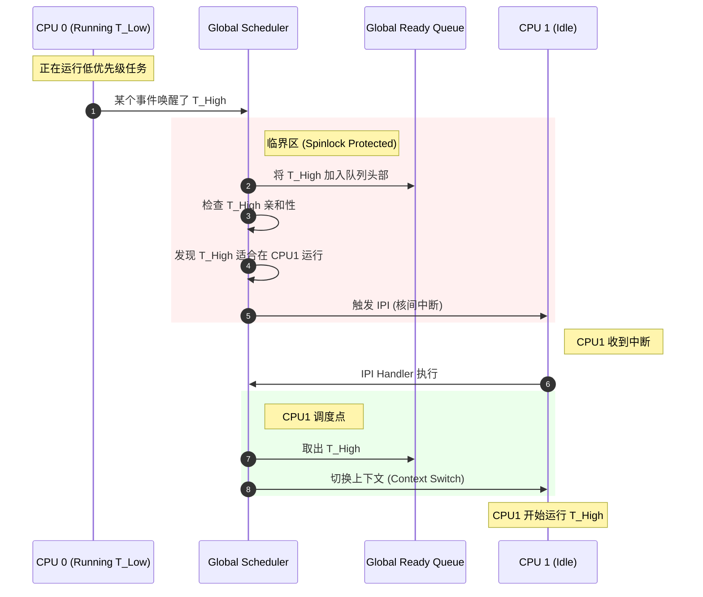

# SMP 多核调度特性详解

> [!note]
> **Ref:** 
> *   `$ZEPHYR_BASE/doc/kernel/services/smp/smp.rst`
> *   `$ZEPHYR_BASE/doc/kernel/services/scheduling/index.rst`

随着嵌入式处理器性能的提升，多核 (Multi-Core) 架构如 ESP32、nRF5340 等变得日益普及。Zephyr 对 **SMP (Symmetric Multi-Processing)** 提供了原生支持，但这同时也引入了全新的调度复杂性和并发挑战。

## 1. 核心概念：SMP 调度模型

### 1.1 全局就绪队列 (Global Ready Queue)
Zephyr 的 SMP 实现采用**共享就绪队列**模型。
*   **单一队列**：所有处于就绪态的线程都挂在同一个全局链表中（按优先级排序）。
*   **多消费者**：多个 CPU 核心同时从这个队列中“抢”任务执行。
*   **锁保护**：必须使用**自旋锁 (Spinlock)** 保护对就绪队列的访问，防止多个核同时操作链表导致崩溃。

### 1.2 调度决策
当一个 CPU 需要调度时：
1.  它获取全局调度锁。
2.  查找就绪队列中优先级最高的线程。
3.  **亲和性检查**：检查该线程是否允许在这个 CPU 上运行（见下文）。
4.  如果允许，将其摘下并运行；如果不允许，继续查找下一个。

## 2. 关键机制

### 2.1 CPU 亲和性 (CPU Affinity)
默认情况下，线程可以在任意 CPU 上运行，且可能在不同 CPU 之间迁移。但有时我们需要固定线程运行在特定核上（例如该核独占某个外设）。

*   **API**: `k_thread_cpu_pin(struct k_thread *thread, int cpu_id)`
    *   将线程绑定到 `cpu_id`。
    *   传入 `K_CPU_ANY` 解除绑定。
*   **API**: `k_thread_cpu_mask_clear(thread)` / `k_thread_cpu_mask_enable(thread, cpu_id)`
    *   更灵活的控制（允许在 CPU0 和 CPU2 上跑，但不许在 CPU1 上跑）。

### 2.2 核间中断 (IPI - Inter-Processor Interrupt)
当 CPU0 决定唤醒一个高优先级线程，而该线程适合在 CPU1 上运行时，CPU0 如何通知 CPU1 进行调度？
*   **机制**：CPU0 触发一个 IPI 中断给 CPU1。
*   **动作**：CPU1 收到中断，进入 ISR，并在退出 ISR 时触发调度检查 (`z_swap`)。
*   **效果**：实现了跨核的抢占。

### 2.3 自旋锁 (Spinlock)
在单核系统中，关中断 (`irq_lock`) 就足以保护临界区。但在 SMP 系统中，**关中断只能禁止当前 CPU 的中断，无法阻止另一个 CPU 访问共享数据**。

*   **必须使用自旋锁**：
    ```c
    struct k_spinlock my_lock;
    k_spinlock_key_t key;

    key = k_spin_lock(&my_lock);
    // 临界区：此时持有锁且关中断
    // 严禁调用任何可能睡眠的 API (k_sleep, k_sem_take)！
    k_spin_unlock(&my_lock, key);
    ```
*   **死锁陷阱**：
    *   如果你在持有自旋锁时睡眠，或者尝试获取同一个自旋锁两次（非递归），CPU 将**永久自旋**，系统卡死。

## 3. 调度流程图解 (Mermaid)



## 4. 开发最佳实践

### 4.1 避免隐式假设
*   **错误**：“我在 ISR 里，所以除了更高优先级的中断，没人能打断我。”
*   **真相**：在 SMP 下，另一个核上的线程可能正在并行访问你的数据！**必须加锁**。

### 4.2 锁的选择
*   **短临界区**（几条指令）：使用 `k_spinlock`。
*   **长临界区**（可能耗时）：使用 `k_mutex`。
    *   Mutex 会导致线程睡眠，自旋锁会导致 CPU 空转。

### 4.3 亲和性谨慎使用
*   除非有硬件限制（如某外设中断只能路由到 Core 0），否则**不要**随意绑定线程到特定 CPU。
*   **原因**：这会破坏负载均衡，导致一个核忙死，另一个核围观。

### 4.4 栈溢出检查
*   SMP 环境下，栈溢出可能导致极其诡异的崩溃（踩踏其他核的栈）。务必开启 `CONFIG_STACK_SENTINEL` 或硬件栈保护。
