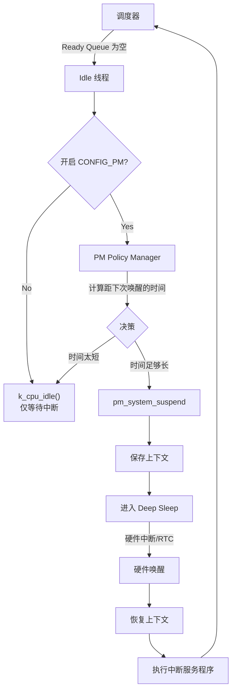

# Idle 线程与低功耗 (Power Management)

> [!note]
> **Ref:** 
> *   `$ZEPHYR_BASE/doc/services/pm/system.rst`
> *   `$ZEPHYR_BASE/doc/kernel/services/threads/index.rst`

在 RTOS 中，“空闲”并不意味着无所事事。**Idle 线程** 是系统能效管理的核心枢纽。当所有业务线程都处于阻塞或挂起状态时，Idle 线程接管 CPU，并决定系统该“睡”多深。

## 1. Idle 线程的角色

*   **优先级**：系统最低 (`K_LOWEST_THREAD_PRIO`)。
*   **创建**：系统启动时自动创建。
*   **任务**：
    1.  回收终止线程的资源（如栈空间）。
    2.  执行空闲钩子函数 (`k_thread_idle_entry`)。
    3.  **触发电源管理系统 (PM Subsystem)**。

## 2. 从 Idle 到低功耗

当调度器发现 Ready Queue 为空时，它会切换到 Idle 线程。Idle 线程随后会调用内核内部的电源管理逻辑。

### 2.1 决策流程
Zephyr 的电源管理子系统 (`CONFIG_PM`) 会根据**“下一次最近的定时事件还有多久发生”**来决定进入哪种功耗模式。

1.  **计算空闲时长**：内核查看定时器链表，发现下一个超时（Timeout）是在 100ms 后。
2.  **查询策略 (Policy Manager)**：
    *   如果有任务只需要 1ms 后就运行 -> 保持 **Active** 或浅睡眠。
    *   如果 100ms 无事可做 -> 可以进入 **Deep Sleep**。
3.  **状态迁移**：调用 SoC 相关的 API 切换电源状态。

### 2.2 功耗状态 (Power States)

Zephyr 定义了一系列通用的电源状态 (`pm_state`)，从浅到深：

| 状态 | 描述 | 唤醒延迟 | 上下文保留 |
| :--- | :--- | :--- | :--- |
| **ACTIVE** | CPU 正常运行，仅时钟门控 | 无 | 全保留 |
| **RUNTIME_IDLE** | CPU 停止指令执行 (WFI) | 极短 | 全保留 |
| **SUSPEND_TO_IDLE** | 外设时钟关闭，RAM 自刷新 | 短 | 全保留 |
| **STANDBY** | 核心断电，大部分外设断电 | 长 | **丢失** (需恢复) |
| **OFF** | 完全断电 | 最长 | **丢失** (冷启动) |

## 3. 钩子函数与应用扩展

开发者可以通过定义钩子函数在 Idle 期间执行后台任务（如看门狗喂狗、统计 CPU 使用率），但必须小心**不要阻塞**，否则会影响低功耗进入。

```c
/* 这是一个弱定义的钩子，用户可以重写 */
void k_thread_idle_entry(void)
{
    /* 1. 做一些后台清理工作 */
    
    /* 2. 进入休眠 */
    k_cpu_idle();
}
```

## 4. 流程图解 (Mermaid)


---




## 5. 开发最佳实践

1.  **让 Idle 跑起来**：如果你的系统 Idle 线程一直得不到运行，说明 CPU 负载 100%，功耗会非常高。检查是否有线程在做 `while(1)` 死循环而没有 `k_sleep`。
2.  **避免在 Idle Hook 中阻塞**：`k_thread_idle_entry` 中绝对不能调用任何阻塞 API，否则 CPU 将无法进入低功耗模式。
3.  **设备电源管理 (Device PM)**：系统进入休眠前，Zephyr 会自动挂起（Suspend）所有注册的设备驱动。确保你的驱动实现了 PM 回调。

