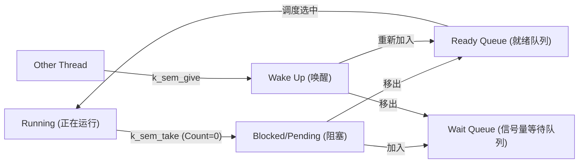

# 信号量 API 参考 (Semaphore API Reference)

> [!note]
> **Ref:** [Zephyr Semaphore APIs](https://docs.zephyrproject.org/latest/kernel/services/synchronization/semaphores.html)

## 宏定义 (Macros)

### `K_SEM_DEFINE`

静态定义并初始化一个信号量。

```c
/**
 * @brief Statically define and initialize a semaphore.
 *
 * The semaphore can be accessed outside the module where it is defined using:
 * @code extern struct k_sem <name>; @endcode 
 *
 * @param name Name of the semaphore.
 * @param initial_count Initial semaphore count.
 * @param count_limit Maximum permitted semaphore count.
 */
#define K_SEM_DEFINE(name, initial_count, count_limit)
```

## 函数 (Functions)

### `k_sem_init`

初始化一个信号量。

```c
/**
 * @brief Initialize a semaphore.
 *
 * This routine initializes a semaphore object, prior to its first use.
 *
 * @param sem Address of the semaphore.
 * @param initial_count Initial semaphore count.
 * @param limit Maximum permitted semaphore count.
 *
 * @return 0 on success.
 * @return -EINVAL Invalid values (e.g. limit == 0 or initial_count > limit).
 */
int k_sem_init(struct k_sem *sem, unsigned int initial_count, unsigned int limit);
```

### `k_sem_take`

获取一个信号量 (P 操作 / Wait)。

```c
/**
 * @brief Take a semaphore.
 *
 * This routine takes @a sem.
 *
 * @note Can be called by ISRs, but @a timeout must be set to K_NO_WAIT.
 *
 * @param sem Address of the semaphore.
 * @param timeout Waiting period to take the semaphore (e.g. K_NO_WAIT, K_FOREVER),
 *                or one of the convenience macros like K_SECONDS(1), K_MSEC(100).
 *
 * @retval 0 Semaphore taken.
 * @retval -EBUSY Returned without waiting.
 * @retval -EAGAIN Waiting period timed out.
 */
int k_sem_take(struct k_sem *sem, k_timeout_t timeout);
```

### `k_sem_give`

释放一个信号量 (V 操作 / Signal)。

```c
/**
 * @brief Give a semaphore.
 *
 * This routine gives @a sem, unless the semaphore is already at its maximum
 * permitted count.
 *
 * @note Can be called by ISRs.
 *
 * @param sem Address of the semaphore.
 *
 * @return void
 */
void k_sem_give(struct k_sem *sem);
```

### `k_sem_reset`

重置信号量的计数值。

```c
/**
 * @brief Reset a semaphore's count to zero.
 *
 * This routine sets the count of @a sem to zero.
 * Any routine that was waiting for the semaphore will remain waiting.
 *
 * @param sem Address of the semaphore.
 *
 * @return void
 */
void k_sem_reset(struct k_sem *sem);
```

### `k_sem_count_get`

获取信号量的当前计数值。

```c
/**
 * @brief Get a semaphore's current count.
 *
 * @param sem Address of the semaphore.
 *
 * @return Current semaphore count.
 */
unsigned int k_sem_count_get(struct k_sem *sem);
```

---

# 核心机制：

### 1. Ready Q，Wait Q
在 Zephyr 内核中，**Ready Queue (就绪队列)** 仅存放“万事俱备，只欠 CPU”的线程。e.g.: 如果一个线程调用 `k_sem_take` 失败（信号量为0）：
*   **资源缺失**：该线程此刻无法向下执行任何有效指令。
*   **避免忙等**：如果留在 Ready Q，调度器会不断选中它，导致其在 `k_sem_take` 内部死循环检查计数，白白浪费 CPU 周期并导致低优先级线程饿死。
*   **能效优化**：移除 Ready Q 是为了让出 CPU 给其他真正能运行的线程。

### 2. `k_sem_take` 内部逻辑流程

> [!tip]
>
> 当 k_sem_take 传入 K_NO_WAIT 参数时，该操作会变成一个非阻塞（Non-blocking）的尝试。
>
> | 超时参数 (Timeout) | 信号量不可用时的行为 | 返回值 (Return Value) | 线程状态 (Thread State) | 是否进入 Wait Q | 上下文切换 (Context Switch) |
| :--- | :--- | :--- | :--- | :--- | :--- |
| **`K_NO_WAIT`** | 立即返回，不阻塞 | `-EBUSY` | **Running** (继续运行) | **否** | **无** |
| **`K_FOREVER`** | 无限期等待资源 | `0` (直到被 Give) | **Blocked** (阻塞) | **是** | **有 (z_swap)** |
| **`K_MSEC(n)`** | 最多等待 `n` 毫秒 | `0` (成功) 或 `-EAGAIN` (超时) | **Blocked** (临时阻塞) | **是** | **有 (z_swap)** |


当 `initial_count == 0` 且 `timeout > 0` 时，内核执行以下原子操作：

1.  **Pending**：将当前线程状态从 `_THREAD_READY` 改为 `_THREAD_PENDING` (阻塞)。
2.  **移除 (Dequeue)**：将线程从内核全局的 **Ready Queue** 中移除。
3.  **入队 (Wait Q)**：将线程加入到该信号量对象私有的 **Wait Queue** 链表中。
4.  **上下文切换 (Swap)**：触发 `z_swap()`，调度器从 Ready Q 中选择下一个最高优先级的线程运行。

### 3. 唤醒与恢复逻辑
当另一个线程调用 `k_sem_give` 时：

1.  **检索 (Retrieve)**：内核检查信号量的 **Wait Queue**。
2.  **解挂 (Unpend)**：如果有线程在等待，取回头部线程（通常是等待时间最长或优先级最高的）。
3.  **重新入队 (Ready Q)**：将该线程状态改回 `_THREAD_READY`，并重新放回系统的 **Ready Queue**。
4.  **抢占检查 (Preemption)**：如果被唤醒的线程优先级高于当前运行线程，内核将立即执行上下文切换。

### 4. 状态转换示意图 (Mermaid)



