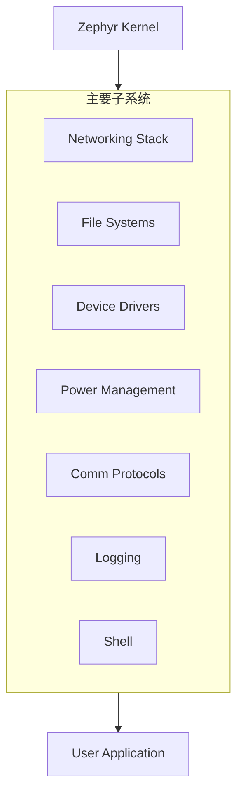

# Zephyr OS 核心特性与架构概览

Zephyr OS 是一个基于小内存内核（Small-footprint Kernel）的实时操作系统，专为资源受限的嵌入式系统设计。它的应用范围极广，从简单的环境传感器、LED 可穿戴设备，到复杂的嵌入式控制器、智能手表及物联网（IoT）无线应用。

## 1. 核心架构支持

Zephyr 内核支持多种主流架构，展现了其强大的跨平台能力：

- **ARC**: ARCv2 (EM and HS), ARCv3 (HS6X)
- **ARM**:
    - ARMv6-M, ARMv7-M, ARMv8-M (Cortex-M 系列)
    - ARMv7-A, ARMv8-A (Cortex-A 系列, 32/64-bit)
    - ARMv7-R, ARMv8-R (Cortex-R 系列, 32/64-bit)
- **Intel x86**: 32-bit 和 64-bit
- **MIPS**: MIPS32 Release 1 规范
- **RISC-V**: 32-bit 和 64-bit
- **其他**: Renesas RX, SPARC V8, Tensilica Xtensa

## 2. 关键特性 (Distinguishing Features)

Zephyr 提供了丰富且不断增长的功能集，主要包括：

### 2.1 广泛的内核服务 (Kernel Services)
Zephyr 提供了一套完整的开发服务，包括多线程服务、中断服务、线程间同步、数据传递、电源管理等。

### 2.2 原生网络协议栈 (Native Networking Stack)
- **多协议支持**: 包含 LwM2M 和 BSD Sockets 兼容支持。
- **OpenThread**: 在 Nordic 芯片组上提供支持，适用于构建安全可靠的家庭网状网络。

### 2.3 蓝牙低功耗 (BLE) 5.0 支持
符合 Bluetooth 5.0 规范 (ESR10)，包含 BLE 控制器（Link Layer）和 Host 协议栈。
- **Generic Access Profile (GAP)**: 支持所有可能的 LE 角色。
- **Generic Attribute Profile (GATT)**.
- **Mesh Support**: 支持中继（Relay）、Friend Node、低功耗节点（LPN）和 GATT Proxy 特性。
- **配置灵活**: 甚至可适配仅有 16k RAM 的设备。

### 2.4 原生跨平台开发
- **构建系统**: 基于 CMake 的命令行构建环境，支持 Linux, macOS 和 Windows。
- **Native Port (native_sim)**: 允许开发者在 Linux 上将 Zephyr 作为原生应用编译运行，极大地加速了开发和测试流程。

### 2.5 虚拟文件系统 (VFS)
支持多种文件系统后端：
- **LittleFS** & **FatFS**: 通用文件系统支持。
- **ext2**: 支持扩展文件系统。
- **FCB (Flash Circular Buffer)**: 专为内存受限应用设计的闪存循环缓冲区。

### 2.6 强大的日志框架
支持日志过滤、对象转储（Object Dumping）、Panic Mode 以及多种后端（内存、网络、文件系统、控制台）。

### 2.7 用户友好的 Shell 接口
- **多实例支持**: 支持通过 UART, Telnet, RTT 等多种方式访问。
- **交互特性**: 自动补全、通配符、颜色高亮、命令历史记录。

### 2.8 非易失性存储 (NVS)
- **Settings Subsystem**: 提供了一种存储持久化设备配置和运行时状态的方法（Key-Value 键值对）。
- **NVS**: 允许存储二进制 Blobs、字符串、整数等混合数据。

## 3. 基本概念 (Subsystems)

在 Zephyr OS 语境下，“子系统” (Subsystem) 指的是操作系统中处理特定功能或提供特定服务的逻辑独立部分。

每个子系统都设计为模块化的，可以根据不同的嵌入式应用需求进行配置（Configured）、定制（Customized）和扩展（Extended）。

## 4. 许可 (Licensing)
Zephyr 采用宽松的 **Apache 2.0 License**，允许商业闭源使用，同时也包含部分使用其他兼容许可证的导入组件。
