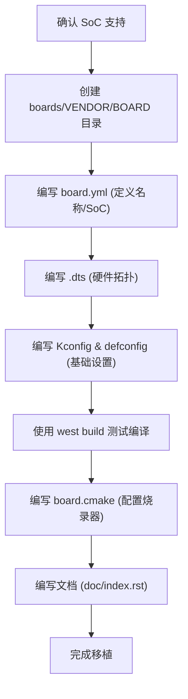

# Zephyr 开发板移植 (Board Porting) 指南

移植一个新的开发板到 Zephyr 涉及定义其硬件配置、选择支持的 SoC、以及配置编译系统。

## 1. 目录结构

所有开发板的定义都存放在 `boards/` 目录下，通常遵循 `boards/<VENDOR>/<BOARD_NAME>` 的路径格式。

一个典型的开发板目录结构如下：

```text
boards/<VENDOR>/<BOARD_NAME>
├── board.yml                # [强制] 开发板元数据定义 (名称, SoC, 变体)
├── <BOARD_NAME>.dts         # [强制] 设备树源文件 (硬件拓扑描述)
├── Kconfig.<BOARD_NAME>     # [强制] 基础 Kconfig 选择
├── board.cmake              # [可选] 配置烧录 (Flash) 和调试 (Debug) 工具
├── CMakeLists.txt           # [可选] 额外的构建逻辑
├── Kconfig.defconfig        # [可选] 默认 Kconfig 配置值
├── <BOARD_NAME>_defconfig   # [可选] 强制性/基础配置（通常在 build 时合并）
├── doc/                     # [可选] 开发板文档及图片
└── <BOARD_NAME>.yaml        # [可选] Twister 测试工具的元数据
```

## 2. 核心文件详解

### 2.1 `board.yml`
这是开发板的入口文件，描述了开发板的高层元数据。它定义了：
- **Name**: 开发板的官方名称。
- **Vendor**: 供应商。
- **Revisions**: 硬件版本。
- **SoCs**: 开发板所使用的 SoC（必须先有 SoC 支持才能移植 Board）。

### 2.2 设备树 (`.dts`)
`.dts` 文件是硬件描述的核心。它通过包含 SoC 的 `.dtsi` 文件并添加板级特定的配置来工作：
- **节点定义**: LEDs, 按键, 外部传感器。
- **外设使能**: 启用 UART, I2C, SPI, Wi-Fi 等。
- **引脚配置 (Pin Control)**: 定义具体功能引脚映射。
- **别名 (Aliases)**: 定义 `led0`, `sw0`, `uart-con` 等通用别名，方便应用代码调用。

### 2.3 `Kconfig.<BOARD_NAME>`
定义该开发板特有的配置选项，并选择正确的 SoC 架构。

## 3. 移植工作流



## 4. 关键建议与最佳实践

1.  **最小化原则**: 默认应在 Kconfig 中关闭大多数子系统，仅在 `.dts` 中启用必要的硬件。
2.  **默认控制台**: 务必配置一个默认的 `zephyr,console` (通常是某个 UART 实例)，以便获取日志。
3.  **内存保护**: 尽可能开启 MPU (Memory Protection Unit) 和 栈保护 (Stack Protection) 以增强系统稳定性。
4.  **复用现有的定义**: 优先使用 SoC 供应商提供的 `.dtsi` 和 `.h` 文件。

## 5. 烧录与调试支持 (`board.cmake`)

为了使 `west flash` 和 `west debug` 命令生效，需要在 `board.cmake` 中定义烧录器后端。
例如，对于使用 `esptool` 的 ESP32 开发板：

```cmake
board_set_flasher_ifnset(esptool)
board_set_debugger_ifnset(openocd)
```

更多详细信息请参考官方文档：[Board Porting Guide](https://docs.zephyrproject.org/latest/hardware/porting/board_porting.html)
