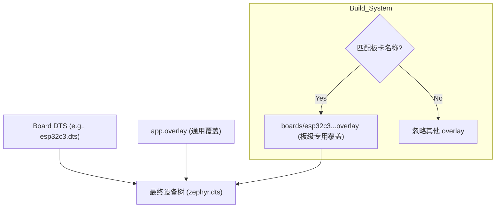

# Zephyr Devicetree Overlays (.overlay) 机制详解

在 Zephyr 项目中，你经常会在 `boards/` 目录下看到 `.overlay` 文件。理解这一机制对于掌握 Zephyr 的硬件配置至关重要。

## 1. 什么是 Overlay？

Devicetree Overlay（设备树覆盖）是一个 `.dts` 格式的片段，用于在**不修改原始设备树源文件 (DTS/DTSI)** 的情况下，动态地修改或扩展硬件配置。

构建系统会将所有相关的 Overlay 文件追加到基础 `BOARD.dts` 之后进行编译。由于 DTS 的“后定义覆盖先定义”特性，Overlay 中的配置会覆盖基础配置。

## 2. 为什么需要 `boards/*.overlay`？

在示例工程（如 `blinky`）中，通常会有一个 `boards/` 目录，里面包含类似 `nrf54h20dk_nrf54h20_cpuppr.overlay` 的文件。这些文件的作用是：

*   **特定板卡的适配补丁**：标准的 `blinky` 示例依赖一个名为 `led0` 的别名。如果某些板卡的基础 DTS 文件（位于 Zephyr 源码仓）没有定义这个别名，或者是定义有误，或者默认禁用了 GPIO 控制器，示例的维护者就会在示例工程内添加一个该板卡专用的 Overlay 来“修复”环境，确保示例能顺利运行。
*   **非侵入式修改**：这避免了为了跑通一个简单示例而去修改 Zephyr 核心源码仓中的板卡定义文件。

## 3. Overlay 的加载机制

Zephyr 构建系统 (`cmake`) 会按照优先级自动查找并应用 Overlay 文件：

1.  **DTC_OVERLAY_FILE 变量**：通过命令行 `-DDTC_OVERLAY_FILE="file1.overlay;file2.overlay"` 显式指定的最高优先级文件。
2.  **应用目录下的 `app.overlay`**：如果当前目录下存在 `app.overlay`，会自动加载并应用到**所有**板卡。
3.  **应用目录下的 `boards/<BOARD>.overlay`**：构建系统会自动检查 `boards/` 目录下是否存在与当前目标板卡名称匹配的 Overlay 文件。
    *   例如：你编译时指定 `-b esp32c3_luatos_core`。
    *   系统会查找 `boards/esp32c3_luatos_core.overlay`。
    *   系统**完全忽略** `boards/` 下其他名字的 Overlay（如 `nrf54h20dk...overlay`）。

## 4. 总结与应用

*   **对于你的 ESP32C3 板卡**：`prj/01-blinky/boards/nrf54h20dk_...overlay` 文件**完全不起作用**，也不会影响你的构建。你可以安全地忽略或删除它。
*   **如何自定义**：如果你想修改自己板卡的配置（例如把 `led0` 改到另一个引脚），你应该在工程根目录下创建一个 `app.overlay`，或者在 `boards/` 下创建一个 `esp32c3_luatos_core.overlay`。

