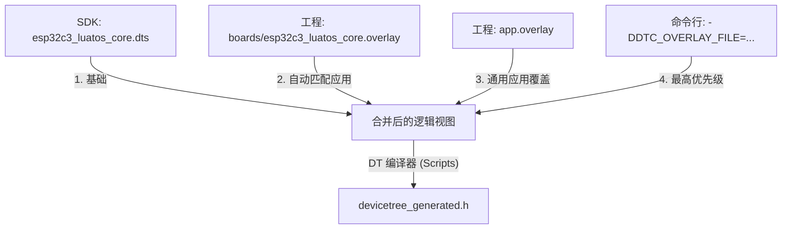

# Zephyr 设备树 (DTS) 加载与合并流程解析

当执行 `west build -b esp32c3_luatos_core` 时，构建系统会按照严密的逻辑查找、包含并合并多个 DTS 片段，最终生成反映硬件全貌的配置文件。

## 1. 静态查找路径 (The "Chain of Truth")

构建系统首先在 SDK 的板卡目录中定位入口文件。对于 `esp32c3_luatos_core`，其继承关系如下（从底层到顶层）：

1.  **架构层 (`riscv.dtsi`)**: 定义 RISC-V 处理器的通用特性。
2.  **SoC 控制器层 (`esp32c3.dtsi`)**: 定义芯片内部寄存器地址、中断号（如 GPIO, UART 控制器）。
3.  **模组/封装层 (`esp32c3_mini_n4.dtsi`)**: 定义特定封装下的 Flash 大小、外扩 PSRAM 等。
4.  **板级基础定义 (`esp32c3_luatos_core.dtsi`)**: 定义开发板上的外设连接（如 LED 接在哪个引脚）。
5.  **板级入口文件 (`esp32c3_luatos_core.dts`)**: 最终确定 `chosen` 节点（系统默认控制台等）。

## 2. 动态覆盖流程 (Application Overlays)

在处理完 SDK 中的标准文件后，构建系统会扫描**当前应用工程**目录，寻找用户自定义的修改：

### 关键机制：
- **同名匹配**: 只有文件名与 `-b` 参数指定的板卡名完全一致的 `.overlay` 才会被加载。这解释了为什么工程里的 `nrf54h20dk...` 文件被忽略了。
- **后发制人**: DTS 允许重复定义节点。如果 `app.overlay` 中修改了某个引脚的参数，它会覆盖之前所有文件的定义。

## 3. 产物转化 (From DTS to C)

最终的合并结果并不会直接被编译器读取，而是经历两次转化：

1.  **文本产物 (`zephyr.dts`)**: 
    - 路径：`build/zephyr/zephyr.dts`
    - 作用：合并后的最终 DTS 文本。每一行都有注释（如 `/* in ... */`）标明其来源，是排查硬件配置问题的核心依据。
2.  **宏产物 (`devicetree_generated.h`)**:
    - 路径：`build/zephyr/include/generated/zephyr/devicetree_generated.h`
    - 作用：将树状结构展平为数千个 C 语言宏（如 `DT_N_S_leds_S_led_1_P_gpios`）。

## 4. 总结：开发者如何参与？

作为开发者，你不需要修改 SDK 中的任何文件。
- 如果你想修改**特定板卡**在当前工程的行为，在 `boards/` 下创建 `<BOARD>.overlay`。
- 如果你想修改**所有板卡**在当前工程的行为，创建 `app.overlay`。
- 最终通过 `build/zephyr/zephyr.dts` 验证你的修改是否生效。
