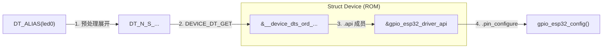

# Zephyr 设备静态绑定机制 (Static Binding)

> [!note]
> **Ref:** [Zephyr Device Model](../subsystem/Device Driver Model/00-Abstract.md)

在 Linux 中，驱动绑定是运行时通过字符串匹配完成的。而在 Zephyr 中，应用层代码 `DT_ALIAS(led0)` 如何一步步调用到 `drivers/gpio/gpio_esp32.c` 中的函数？这就是 **静态绑定 (Static Binding)** 的核心魔法。

## 1. 核心链路图解 (The Flow)

整个过程可以概括为：**宏展开 =>  链接器符号  => 结构体指针  => 函数跳转**。



## 2. 详细步骤解析

### 2.1 阶段一：宏展开 (Macro Expansion)
应用层代码：
```c
/* main.c */
const struct gpio_dt_spec led = GPIO_DT_SPEC_GET(DT_ALIAS(led0), gpios);
```
预处理器将 `DT_ALIAS(led0)` 展开为唯一的 **节点标识符 (Node Identifier)**：
`DT_N_S_leds_S_led_1` (即 `/leds/led_1`)

### 2.2 阶段二：获取设备对象 (Device Object)
`GPIO_DT_SPEC_GET` 宏内部调用 `DEVICE_DT_GET(node_id)`。

关键在于 `DEVICE_DT_GET` 的定义：
```c
/* include/zephyr/device.h */
#define DEVICE_DT_GET(node_id) (&__device_dts_ord_##node_id)
```
它拼接出一个 **全局变量名**：`&__device_dts_ord_DT_N_S_leds_S_led_1`。

这个变量是谁定义的？
**正是驱动源码中的 `DEVICE_DEFINE` 宏！在编译时，构建系统会确保每个 `DT_INST` 宏都生成一个对应的 `struct device` 实例，并且其符号名与上述宏拼接规则严格一致。**

### 2.3 阶段三：API 表查找 (API Lookup)
现在应用层持有了指向 `struct device` 的指针。这个结构体在 ROM 中是这样定义的：

```c
/* drivers/gpio/gpio_esp32.c */
static const struct device __device_dts_ord_... = {
    .name = "GPIO_0",
    .api  = &gpio_esp32_driver_api, // <--- 关键！指向驱动实现的函数表
    ...
};
```

### 2.4 阶段四：函数跳转 (Function Call)
当应用层调用 API 时：
```c
/* z_impl_gpio_pin_configure */
const struct gpio_driver_api *api = (const struct gpio_driver_api *)port->api;
return api->pin_configure(port, pin, flags);
```
这是一次普通的 **C 语言函数指针调用**。CPU 直接跳转到 `gpio_esp32.c` 中的 `gpio_esp32_config` 函数地址。

## 3. 静态绑定的优势

1.  **类型安全**: 如果 DTS 中没有 `led0`，`DT_ALIAS(led0)` 展开的宏在头文件中找不到定义，编译直接报错。
2.  **零运行时开销**: 
    *   没有字符串匹配 (No `strcmp`).
    *   没有哈希查找 (No Hash Map).
    *   没有链表遍历 (No List Traversal).
    *   所有地址在链接阶段 (Linking Time) 已确定，运行时只是简单的指针解引用。
3.  **死代码消除**: 如果应用层没有引用某个驱动的 `DEVICE_DT_GET`，链接器可以智能地将未使用的驱动代码丢弃（前提是 `CONFIG_LINKER_ORPHAN_SECTION_WARN` 配置得当）。

---
**总结**: Zephyr 的“设备模型”本质上是一套 **编译时依赖注入 (Compile-time Dependency Injection)** 系统。DTS 是配置文件，宏系统是注入器，而 `struct device` 是接口容器。
