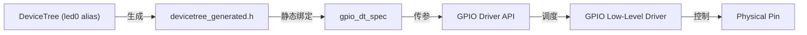

# Zephyr GPIO 子系统设计分析

Zephyr 的 GPIO 设计是其“设备模型（Device Model）”与“设备树（Devicetree, DT）”深度融合的典型代表。通过对 `blinky` 示例的源码分析，可以识别出其核心设计模式。

## 1. 核心数据结构：`gpio_dt_spec`

在 Zephyr 中，GPIO 硬件信息不再是分散的变量，而是封装在 `struct gpio_dt_spec` 中：

```c
struct gpio_dt_spec {
    const struct device *port; // 指向底层驱动实例的指针
    gpio_pin_t pin;            // 硬件引脚号
    gpio_dt_flags_t dt_flags;  // 来自设备树的初始化标志（如 Active Low）
};
```

### 设计意图
- **高内聚**：单一变量封装了操作特定硬件所需的所有静态信息。
- **静态绑定**：通过 `GPIO_DT_SPEC_GET` 宏，在编译阶段从设备树生成的元数据中提取信息。

## 2. API 设计模式：`_dt` 后缀

Zephyr 推崇使用“设备树感知”的接口。

- **传统接口**：需要手动传递端口、引脚和标志。
  - `gpio_pin_configure(port, pin, flags)`
- **DT 接口**：直接接受 `spec` 对象。
  - `gpio_pin_configure_dt(&spec, extra_flags)`

### 优势
- **安全性**：避免了手动传递参数导致的端口与引脚不匹配。
- **逻辑抽象**：如果设备树标注了 `GPIO_ACTIVE_LOW`，`gpio_pin_set_dt` 会自动处理电平翻转，开发者只需关注逻辑状态（ON/OFF）。

## 3. 层级解耦架构

GPIO 的设计实现了应用逻辑与物理硬件的完全解耦。



1. **硬件无关性**：`main.c` 仅引用 `DT_ALIAS(led0)`，不包含物理引脚号或寄存器地址。
2. **驱动一致性**：无论底层是 STM32、nRF 还是 ESP32，上层调用的 API 完全一致。

## 4. 运行时保障：`device_is_ready`

在操作 GPIO 之前，必须调用 `gpio_is_ready_dt()`。
这是由于 Zephyr 的驱动初始化是有序且可能失败的（如 I2C 扩展芯片的 GPIO）。此检查确保了：
- 底层驱动驱动实例已成功挂载。
- 硬件抽象层已就绪。

## 5. 总结

Zephyr GPIO 子系统的本质是 **数据驱动 (Data-Driven)**：
- **设备树** 描述硬件连接。
- **Kconfig** 启用驱动代码。
- **GPIO API** 消费这些数据并提供抽象操作。

这种设计使得同一套应用代码可以无缝移植到数百种不同的板卡上，只需调整对应的 `.dts` 文件。
