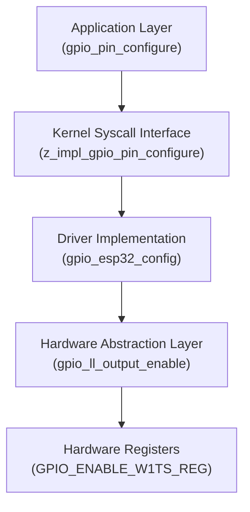

# GPIO 子系统分析 (三)：运行时行为 (Runtime Behavior)

> [!note]
> **Ref:**
> - [include/zephyr/drivers/gpio.h](../../../sdk/source/zephyr/include/zephyr/drivers/gpio.h)
> - [drivers/gpio/gpio_esp32.c](../../../sdk/source/zephyr/drivers/gpio/gpio_esp32.c)
> - [hal/gpio_ll.h](../../../sdk/source/modules/hal/espressif/components/hal/esp32c3/include/hal/gpio_ll.h)

在这一阶段，我们以 `led_d4` (GPIO 12) 的配置为例，完整追踪了从应用层 `gpio_pin_configure()` 到底层寄存器操作的执行链路。

## 1. 链路总览 (Overview)

执行流跨越了四个层级：



## 2. 详细追踪 (Step-by-Step Trace)

### 2.1 应用层 (Application Layer)
应用代码通常这样写：
```c
const struct gpio_dt_spec led = GPIO_DT_SPEC_GET(DT_NODELABEL(led_d4), gpios);
gpio_pin_configure_dt(&led, GPIO_OUTPUT_ACTIVE);
```
这会展开为调用 `gpio_pin_configure(port, pin, flags)`。

### 2.2 系统调用层 (Syscall Layer)
在 `include/zephyr/drivers/gpio.h` 中，`gpio_pin_configure` 被声明为 `__syscall`。这会生成用户模式到内核模式的桥接代码。

**`z_impl_gpio_pin_configure` 的核心逻辑：**
1.  **参数校验**: 检查 flags 是否冲突（如同时 Pull Up 和 Pull Down）。
2.  **逻辑转换**: 处理 `GPIO_ACTIVE_LOW`。如果设置了此标志，内核会自动更新 `data->invert` 掩码，而不会立即修改硬件电平。
3.  **API 路由**: 最终调用 `api->pin_configure(port, pin, flags)`。

### 2.3 驱动层 (Driver Layer)
进入 `drivers/gpio/gpio_esp32.c` 的 `gpio_esp32_config` 函数：

```c
static int gpio_esp32_config(const struct device *dev, gpio_pin_t pin, gpio_flags_t flags)
{
    // 1. 获取 config 结构体，计算绝对引脚号
    const struct gpio_esp32_config *const cfg = dev->config;
    uint32_t io_pin = (uint32_t) pin + ...;

    // 2. 引脚复用配置 (IOMUX)
    gpio_ll_iomux_func_sel(GPIO_PIN_MUX_REG[io_pin], PIN_FUNC_GPIO);

    // 3. 处理上下拉
    if (flags & GPIO_PULL_UP) {
        gpio_ll_pullup_en(&GPIO, io_pin);
    }

    // 4. 处理输出使能
    if (flags & GPIO_OUTPUT) {
        gpio_ll_output_enable(&GPIO, io_pin);
        // ...
    }
}
```

### 2.4 硬件抽象层 (HAL)
最后进入 `hal/gpio_ll.h`，这里是直接的寄存器操作。

**以 `gpio_ll_output_enable` 为例：**
```c
static inline void gpio_ll_output_enable(gpio_dev_t *hw, uint32_t gpio_num)
{
    // 写 1 到 W1TS (Write 1 To Set) 寄存器
    hw->enable_w1ts.enable_w1ts = (0x1 << gpio_num);
}
```
*   **W1TS/W1TC 机制**: ESP32 使用 "Write 1 To Set" 和 "Write 1 To Clear" 寄存器对。这种机制允许原子地修改单个引脚的状态，而无需 Read-Modify-Write 序列，从而避免了竞态条件，这对于多任务环境至关重要。

## 3. 关键机制总结

*   **同步调用 (Synchronous Calls)**: 整个调用链在当前线程上下文中同步执行。虽然涉及多层封装，但最终只是几条内存读写指令，开销极小。
*   **逻辑电平 vs 物理电平**:
    *   **应用层** 关心逻辑电平 (Active/Inactive)。
    *   **内核层 (`z_impl`)** 负责根据 DTS 的 `GPIO_ACTIVE_LOW` 标志维护 `invert` 掩码。
    *   **驱动层** 只关心物理电平 (High/Low)。
*   **原子操作**: HAL 层利用硬件的 W1TS/W1TC 特性保证了操作的原子性，无需额外的软件锁（尽管驱动层在某些复杂配置下使用了 `irq_lock`）。

---
**阶段完成**: 至此，我们已经从硬件定义、驱动初始化到运行时调用，彻底剖析了 Zephyr GPIO 子系统的实现。
