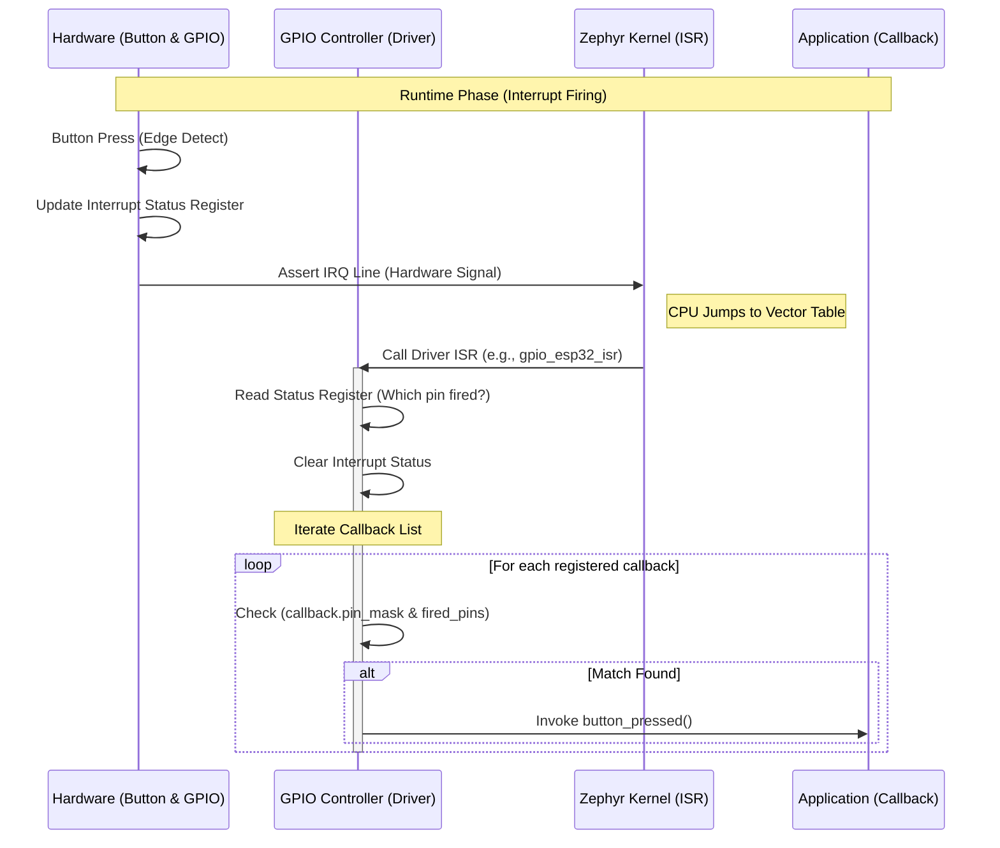

# GPIO 子系统分析 (五)：中断与回调全链路 (Full Link)

> [!note]
> **Ref:** [GPIO API](https://docs.zephyrproject.org/latest/hardware/peripherals/gpio.html)

本篇以一个按键 (Button) 的输入中断为例，深入剖析 Zephyr GPIO 中断处理的全链路机制。

## 1. 硬件描述 (DTS)

首先在设备树中定义按键节点。这里的关键是 `gpios` 属性，它指定了连接的 GPIO 控制器和引脚号。

```dts
/* board.dts or app.overlay */

/ {
    buttons {
        compatible = "gpio-keys";
        button0: button_0 {
            /* 连接到 gpio0 控制器的第 13 号引脚 */
            /* GPIO_ACTIVE_LOW 表示按下时为低电平 */
            gpios = <&gpio0 13 (GPIO_PULL_UP | GPIO_ACTIVE_LOW)>;
            label = "User Button";
        };
    };
};
```

> **注意**: 虽然我们在应用层只关心这个引脚，但在底层，`&gpio0` 控制器本身必须在 DTS 中定义了中断信息 (`interrupts` 属性)，并连接到系统的中断控制器 (如 NVIC 或 GIC)。这是 GPIO 驱动能响应中断的前提。

## 2. 应用层初始化 (Application Setup)

应用层主要完成三件事：配置引脚、注册回调、使能中断。

### 2.1 获取与配置
使用 `gpio_dt_spec` 获取设备信息并配置引脚为输入。

```c
static const struct gpio_dt_spec button = GPIO_DT_SPEC_GET(DT_NODELABEL(button0), gpios);

/* 1. 检查设备就绪 */
if (!gpio_is_ready_dt(&button)) { return; }

/* 2. 配置引脚 (Input + Pull Up) */
gpio_pin_configure_dt(&button, GPIO_INPUT);
```

### 2.2 注册回调 (Register Callback)
Zephyr 使用 **回调链表 (Callback List)** 机制来分发 GPIO 中断。应用层需要定义一个 `struct gpio_callback` 变量，并将其注册到 GPIO 驱动中。

```c
static struct gpio_callback button_cb_data;

/* 用户自定义的回调函数 */
void button_pressed(const struct device *dev, struct gpio_callback *cb, uint32_t pins)
{
    printk("Button pressed at %" PRIu32 "
", k_cycle_get_32());
}

/* 3. 初始化回调结构体 */
/* 设置触发引脚的掩码 BIT(button.pin) */
gpio_init_callback(&button_cb_data, button_pressed, BIT(button.pin));

/* 4. 添加回调到驱动的回调链表中 */
gpio_add_callback(button.port, &button_cb_data);
```

> **关键点**: `gpio_add_callback` 并没有操作硬件，它只是将 `button_cb_data` 节点挂载到了 `button.port` 设备驱动维护的一个单向链表 (`sys_slist_t callbacks`) 上。

### 2.3 使能中断 (Enable Interrupt)
最后一步是告诉硬件开始监听中断信号。

```c
/* 5. 配置并使能引脚中断 (下降沿触发) */
gpio_pin_interrupt_configure_dt(&button, GPIO_INT_EDGE_TO_ACTIVE);
```
此函数会调用到底层驱动 (如 `gpio_esp32_pin_interrupt_configure`)，最终操作硬件寄存器 (如 `GPIO_PIN_INT_ENA`)，解除该引脚的中断屏蔽。

## 3. 全链路执行流程 (Execution Flow)

当按键被按下时，硬件和软件的交互流程如下：



### 3.1 驱动层 ISR 详解
GPIO 控制器的 ISR (例如 `gpio_esp32_isr`) 是所有 GPIO 引脚中断的 **总入口**。它的核心逻辑通常包含：

1.  **读取状态**: 读取硬件的 `Interrupt Status Register`，确定是哪一个或哪几个引脚触发了中断。
2.  **分发回调**: 调用核心库函数 `gpio_fire_callbacks()`。
    ```c
    /* 伪代码 */
    void gpio_fire_callbacks(sys_slist_t *list, const struct device *port, uint32_t pins)
    {
        struct gpio_callback *cb;
        
        /* 遍历链表 */
        SYS_SLIST_FOR_EACH_CONTAINER(list, cb, node) {
            /* 检查回调关注的引脚 (pin_mask) 是否在本次触发的引脚 (pins) 中 */
            if (cb->pin_mask & pins) {
                /* 调用用户函数 */
                cb->handler(port, cb, pins);
            }
        }
    }
    ```

## 4. 总结与最佳实践

1.  **Callback List**: 一个 GPIO 控制器端口 (Port) 维护一个回调链表。这意味着多个不同引脚的回调会挂在同一个链表上。
    -   *性能影响*: 如果一个端口上注册了大量回调，ISR 中的遍历开销会线性增加。
2.  **Stack Usage**: 回调函数是在 **ISR 上下文** 中执行的。
    -   **限制**: 不能执行耗时操作，不能睡眠 (No Blocking)。
    -   **栈空间**: 使用的是中断栈 (ISR Stack)，需注意栈溢出风险。
3.  **原子性**: `gpio_add_callback` 操作链表时会关中断，因此是线程安全的。

通过这套机制，Zephyr 实现了从硬件中断到应用层逻辑的灵活解耦，同时保持了高效的中断响应。
